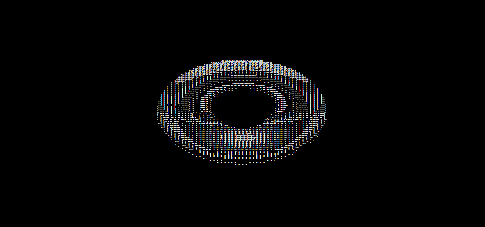

# Day 1 - ASCII Donut Animation

This project is the first in the "20 Days of JavaScript, CSS, HTML" series. It showcases an ASCII art animation of a spinning donut, using JavaScript to manipulate text characters dynamically. The animation illustrates the possibilities of mathematical modeling in creating visual effects with simple character codes.

## Features

- **ASCII Animation**: Displays a rotating donut animation made entirely of ASCII characters, offering a retro feel with a modern twist.
- **JavaScript Calculations**: Uses JavaScript to perform the mathematical calculations necessary for simulating the 3D rotation of the donut.
- **Styling with CSS**: Applies basic styles to position the ASCII art within the web page, ensuring optimal visibility and a clean background.

## Project Structure

- `index.html`: The main HTML document that sets up the structure for the ASCII donut to be displayed.
- `style.css`: The stylesheet that contains the styling rules for the ASCII donut, including its positioning and appearance.
- `index.js`: The JavaScript file that contains the logic to calculate and render the ASCII donut animation.
- `README.md`: The file that you're reading right now, which provides an overview of the project and how it works.

## Running the Project

To run the animation on your local machine, simply clone this repository, navigate to the 'DAY 1 - donut' directory, and open the `index.html` file in a modern web browser. The ASCII donut should start spinning right away.

## 

Feel free to fork this project, play around with the code, and maybe even create your own ASCII animations. Enjoy the art of coding!
