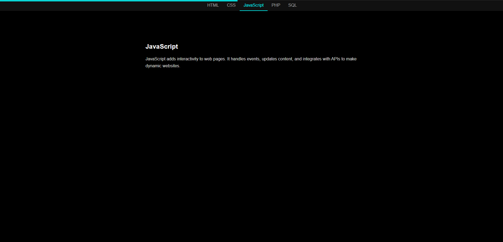

# Day 4 – Scroll Progress Bar

This project is part of the **"7 Days of JavaScript, CSS, HTML"** challenge. It showcases a visual scroll progress indicator powered by JavaScript scroll tracking.

## 🚀 Features

- **Scroll indicator** – Horizontal bar at top.
- **Scroll tracking** – Calculates real-time percentage.
- **Enhanced UX** – Shows reading progress.

## 📂 Files

- `index.html` – Page structure  
- `style.css` – Styling  
- `script.js` – Logic  
- `image.png` – Project preview

## ⚙️ How to Run

1. Clone/download the project  
2. Navigate to `DAY 4 - Scroll Progress`  
3. Open `index.html` in your browser  

## 🔗 Live Preview

[GitHub Pages – Day 4](https://whereismytime.github.io/7-Days-of-JavaScript-CSS-HTML/DAY%204%20-%20Scroll%20Progress/)

## 📸 Preview

