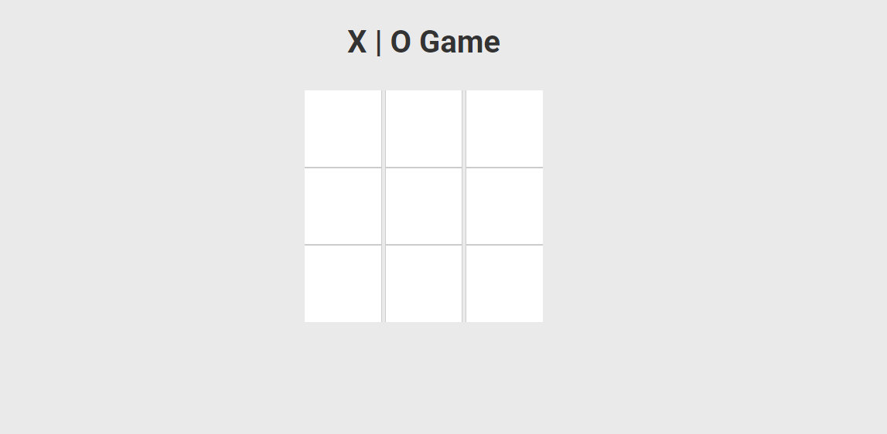

# Day 5 - Tic Tac Toe Game

This project presents a classic Tic Tac Toe game with a modern web interface, allowing users to enjoy a simple yet engaging game. It demonstrates the application of fundamental web development techniques, including HTML, CSS, and JavaScript to create a fully interactive game that can be played on any modern browser.

## Features

- **User Interaction**: Players can take turns by clicking on the game board, placing their X or O in the chosen cell.
- **Responsive Design**: The game layout adapts to various screen sizes for an optimal gaming experience on desktops, tablets, or smartphones.
- **Contemporary Look**: The game board and interface utilize modern design principles for a clean and attractive appearance.
- **Game State Management**: JavaScript logic keeps track of player turns, win conditions, and game state for a seamless play session.

## Project Structure

- `index.html`: The main HTML document containing the game's structure and linking to the CSS and JavaScript files.
- `style.css`: The stylesheet file outlining the game's visual aspects, animations, and responsive design features.
- `script.js`: The JavaScript file responsible for the game's interactive elements, including handling user actions and maintaining the game's state.

## Gameplay

- Players alternate turns to place their symbol (X or O) on the 3x3 grid.
- The first player to align three of their symbols vertically, horizontally, or diagonally wins the game.
- The game alerts players to the outcome (win or draw) and provides an option to restart the game.

## Usage

To start playing the game, open the `index.html` file in any modern web browser. For the best experience, use a browser that supports the latest web standards.

## Screenshot

---

Dive into the code to understand the mechanics of the game or to contribute enhancements. If you have inquiries or feedback, don't hesitate to contact or open a discussion.
