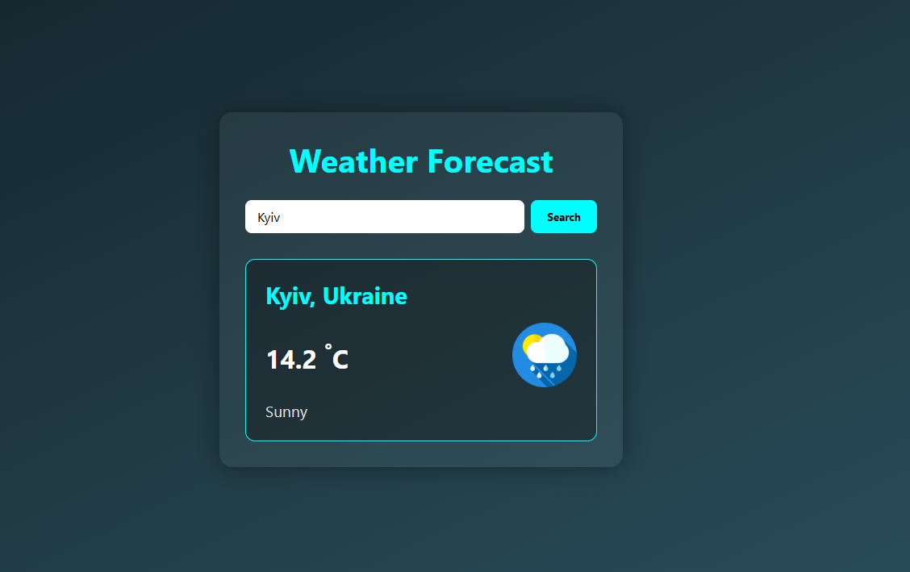

# Day 7 – Weather Information Web App

A web app that shows current weather for a selected city. It demonstrates integrating an external weather API to retrieve data such as temperature and condition descriptions. Also highlights use of async requests (Fetch API) and dynamic UI updates.

## 🚀 Features

- **Weather API** – Fetches real-time weather data from an external API.
- **City Input** – User enters city name to get weather data.
- **Weather Details** – Shows temperature, humidity, condition, and more.

## 📂 Files

- `index.html` – Page structure  
- `style.css` – Styling  
- `script.js` – Logic  
- `screen.png` – Project preview  

## ⚙️ How to Run

1. Clone/download the project  
2. Go to the `DAY 7 - Weather Information Web App` folder  
3. Open `index.html` in a browser  

## 🔗 Live Preview

[GitHub Pages – Day 7](https://whereismytime.github.io/7-Days-of-JavaScript-CSS-HTML/DAY%207%20-%20Weather%20Information%20Web%20App/)

## 📸 Preview

