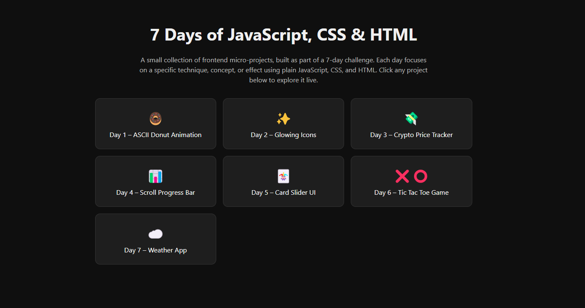

# Day 7 – Weather Information Web App

A simple weather application that displays the current weather of a city. It fetches real-time weather data using the WeatherAPI and updates the interface dynamically based on user input.

## 🚀 Features

- **Weather API** – Fetches live temperature, condition, and location data
- **City Search** – Enter a city name and get instant weather info
- **Dynamic UI** – Updates the view based on results or error state

## 📂 Files

- `index.html` – Page structure  
- `style.css` – Styling and layout  
- `script.js` – Logic and API integration  
- `pogoda.png` – Weather icon used in the result card  
- `photo.png` – (Optional) Preview image for GitHub  
- `screen.png` – (Recommended) GitHub project thumbnail

## ⚙️ How to Run

1. Clone or download the repository  
2. Navigate to `DAY 7 - Weather Information Web App`  
3. Open `index.html` in a browser

## 🔗 Live Preview

[GitHub Pages – Day 7](https://whereismytime.github.io/7-Days-of-JavaScript-CSS-HTML/)

## 📸 Preview

